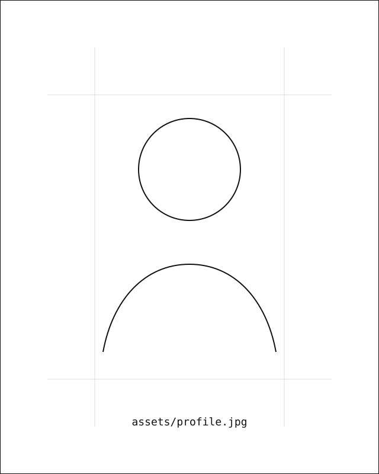

# Zonglin Wu — Minimal CS Academic Homepage v11

A minimal computer-science academic homepage with a pure white base and restrained red accents. Profile, About, News, and Papers all remain white; color is used only in thin rules, borders, scrollbars, hover states, and small emoji details.

## Files

- `index.html` — main homepage
- `assets/style.css` — visual style
- `assets/main.js` — small interactions
- `assets/profile-placeholder.svg` — placeholder image
- `assets/CV_Zonglin_Wu.pdf` — CV copy

## Replace the profile photo

Put your photo into `assets/`, for example:

```text
assets/profile.jpg
```

Then edit `index.html`:

```html

```

Replace it with:

```html

```

## Replace Google Scholar

Search for:

```text
YOUR_GOOGLE_SCHOLAR_ID
```

Replace the whole link with your real Google Scholar profile URL.

## Edit News

The News block is inside:

```html
<section class="section news" id="news">
```

Add or remove `<article class="news-item">...</article>` entries as needed.

## Deploy

Upload the whole folder to GitHub Pages, Netlify, Vercel, or any static hosting service.
